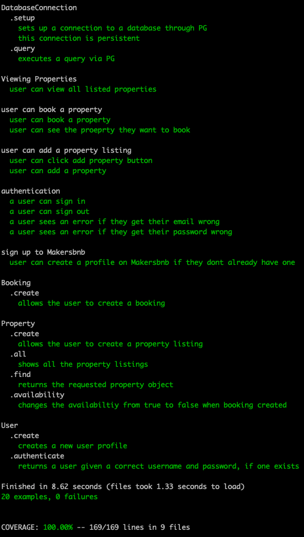

# makersbnb
## Meet the team:

[Savanna](https://github.com/savannaelbey), [Mel](https://github.com/TamMelPer) [Georgie](https://github.com/horthbynorthwest) and [Josh](https://github.com/joshuaretallick)

## Project Goals
-   Break down projects into tasks and allocate them to pairs
-   Build to a specification (rather than challenges)
-   Run stand-ups and retrospectives
-   Use a branch/PR/merge git workflow
-   Give and receive meaningful code review

## User Stories

As a User (Customer / Landlord)
So that I can use Makersbnb
I want to sign up

As a User (Customer / Landlord)
So that I can keep my account secure
I want to login with my email and password

As a User (Customer / Landlord)
So other people cant use my account
I want to be able to log out

As a User (Landlord)
In order to hire out my space
I want to be able to create a listing with name, description and price

As a User (Landlord)
In order to hire out my spaces
I want to be able to list multiple properties

As a User (Landlord)
In order to hire out my spaces
I want to display a range of available dates

As a User (Customer)
So that I can book a spaces
I want to see availability in a specified date range

As a User (Customer)
So that I can make a booking
I want to be able to request a space for one night

As a User (Landlord)
So that I can confirm a booking
I want to be able to approve a booking request

As a User (Landlord)
Until I have approved a booking
I want my property to remain available

As a User (Customer)
So I can plan my holiday
I want to see a list of confirmed bookings

## Planning
We used a trello board to plan and show workflow.

We also started with CRC cards and entity relationship diagrams and this was edited and evolved throughout the course of the week.

We researched the best way to use Git to manage and reduce merge conflicts and we protected the main branch by requiring 2 approvals before merging and no one could push to it directly.

We mobbed during the initial planning stage and then worked in pairs throughout the week. We managed conflicting team member availability with forward planning to ensure that everyone was able to contribute.

## To run locally:

1. Clone this repository and bundle install.
2. Create the database by connecting to `psql`and enter the commands in the db/migrations folder.
3. Run tests with `rspec`
4. Run `rackup` and then open browser to http://localhost:9292/

## Testing

We followed the TDD process throughout, running feature and unit tests to determine the code we were going to write.

## The UI
